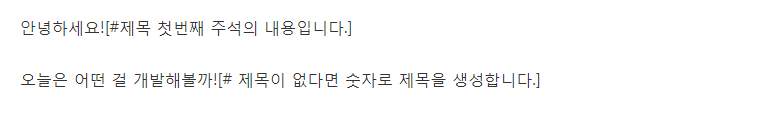
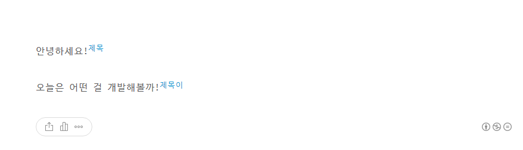
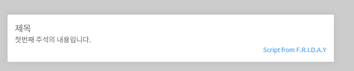
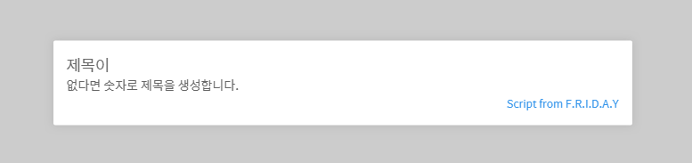

# tmlTitle FootNote
---
tmlTitle.js의 세번째 기능입니다. 이전 에디터에선 제공했지만 현재는 제공하지 않는 주석 기능을 이용할 수 있습니다.

### Index
* [구성 속성](#구성-속성)
* [스크립트 적용 방법](#스크립트-적용-방법)
* [이용 방법](#이용-방법)

## 구성 속성
이 기능의 구성 속성은 다음과 같습니다. **굵게 표시된 속성은 필수 값입니다.**

|속성 이름                  |데이터 타입            |기본값     |설명   							|
|--------------------------:|:----------------------|:---------:|-----------------------------------|
|**contentQuery**			|Array(String)			|-			|글의 시작을 담고 있는 태그 쿼리	|
|trigger					|String                 |'#'	    |주석의 시작임을 알리는 트리거      |
|cursor     			    |String					|'pointer'  |주석 위에 마우스 올려뒀을 때 모양  |
|color                      |String					|'#209dd4'  |본문에 표시할 주석의 색상          |
|titleTag                   |String                 |'h3'       |주석 내용을 문서 하단에 작성시 제목|
|showIntoBottom             |Boolean				|false  	|주석 내용을 문서 하단에 추가 작성  |

### 스크립트 적용 방법
스크립트 적용은 [이 문서를 확인](readme.md#스크립트-적용-방법)하세요. 이 기능을 이용하기 위한 코드는 다음과 같습니다.
```
window.addEventListener('load', function () {
    tmlTitle({
        footNote:{
            contentQuery:['div.area_view']
        }
    });
});
```

컨텐츠 쿼리를 찾는 방법은 [다음](indexor.md#쿼리-찾기)을 참고하세요

### 이용 방법


이런 식으로 대괄호 안에 원하는 주석 내용을 작성해주면 됩니다. 이 때, **트리거문자 다음의 첫 단어가 해당 주석의 제목**이 됩니다. 이후 문자열은 내용이 됩니다.

게시를 하고, 스크립트가 적용되어있다면 위와같이 변경됩니다.



어두운 부분을 클릭하면 주석 내용이 닫힙니다.