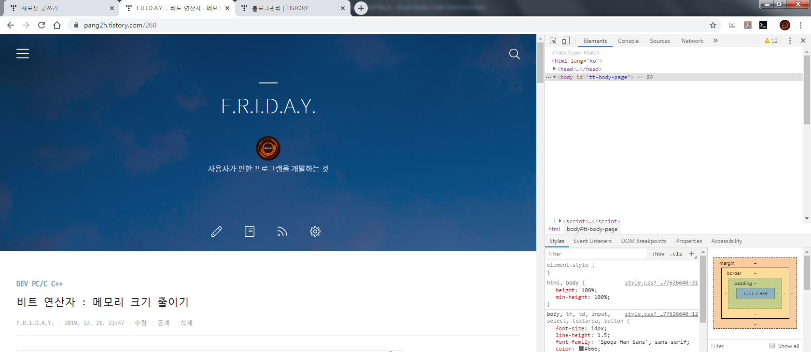
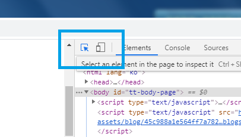
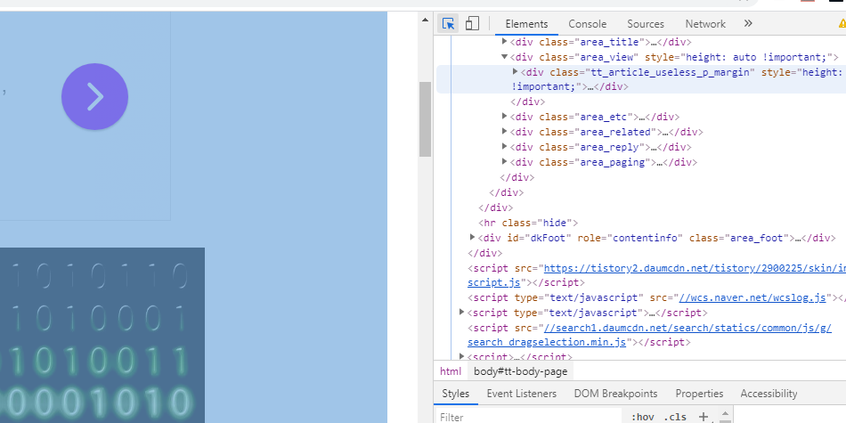
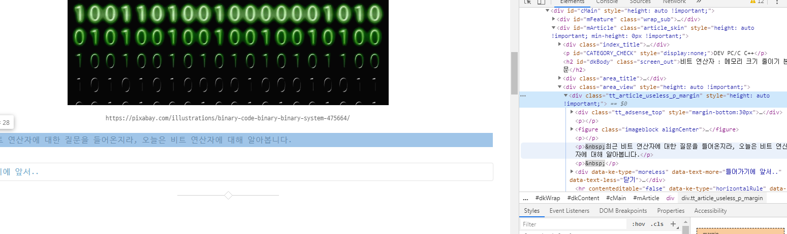
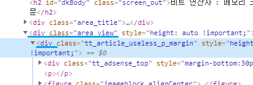
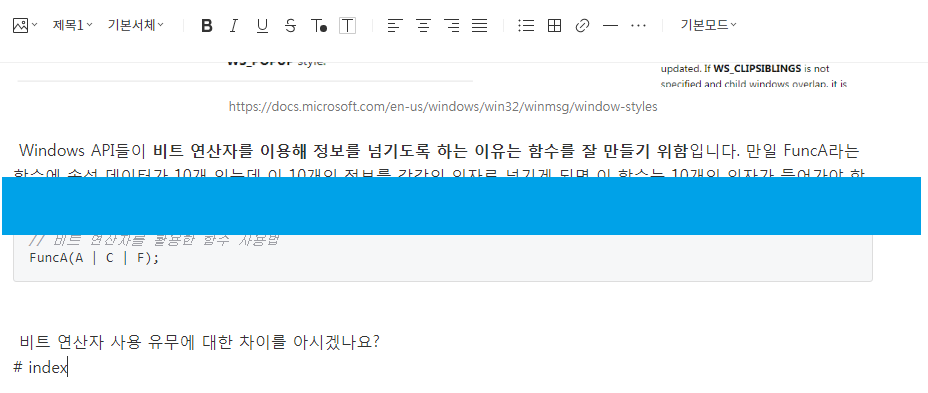

# tmlTitle Indexor
---
기존 tmlTitle에서 추가된 기능입니다. 문서 내용 기반으로 하여 간단한 목차를 생성합니다.

### INDEX
* [구성 속성](#구성-속성)
* [스크립트 적용 방법](#스크립트-적용-방법)
* [이용 방법](#이용-방법)

### 구성 속성
이 기능의 구성 속성은 다음과 같습니다. **굵게 표시된 속성은 필수 값입니다.**

|속성 이름                  |데이터 타입            |기본값     |설명   							|
|--------------------------:|:----------------------|:---------:|-----------------------------------|
|**contentQuery**			|Array(String)			|-			|글의 시작을 담고 있는 태그 쿼리	|
|trigger					|String                 |'# index'	|글의 목차를 만들지 결정하는 트리거	|
|indexorTitleTag			|String					|'h3'		|목차 제목의 태그					|
|indexorTitle				|String					|'Index'	|목차 제목							|
|orderIndex					|Boolean				|false  	|목차 스타일(true:번호)				|
|showReverseBtn             |Boolean				|false  	|목차로 이동하는 버튼 표시 여부     |

### 스크립트 적용 방법
스크립트 적용은 [이 문서를 확인](readme.md#스크립트-적용-방법)하세요. 이 기능을 이용하기 위한 코드는 다음과 같습니다.
```
window.addEventListener('load', function () {
    tmlTitle({
        tagIndexor:{
            contentQuery:['div.area_view']
        }
    });
});
```

> ### 질문1
> [moreLess](readme.md)기능과 함께 사용하고싶어요.
>
> &nbsp; 이럴 땐 아래처럼 작성하면 함께 이용할 수 있습니다.
```
<script>
    window.addEventListener('load', function(){
        tmlTitle({
            moreLessChanger:{
                delTitleContent:true,
                addButton:true
            }, 
            tagIndexor:{
                contentQuery:["div.area_view > div", "div.area_view"]
            }
        });
        
    });
</script>
```
위와 같이 해당 기능을 이용하기 위한 속성을 **반점(컴마)로 구분하여 작성**해주면 됩니다.

여기에서 contentQuery에 들어갈 문자열을 찾는 방법은 다음과 같습니다.

포스트에서 **F12**를 눌러 개발자 도구를 엽니다.



상단 버튼을 클릭, 글 영역을 선택합니다.


오른쪽 소스코드에서 본문의 코드에 마우스를 가져다 대었을 때 본문의 단락이 파랗게 표시되면 찾은 것입니다.


이제 찾은 값을 가지고 본문을 감싸는 태그를 CSS 선택자 문자열로 바꿉니다.
여기에서 구조는
```
    <div class="area_view" ...>
        <div class="tt...">
    .
    .
    .
```
이므로, 선택자 문자열은 다음과 같습니다.
> div.area_view > div

CSS 선택자에 대한 내용은 [다음 포스트](https://code.tutsplus.com/ko/tutorials/the-30-css-selectors-you-must-memorize--net-16048)를 참고하면 좋습니다.

> ### 질문2
> 어째서 contentQuery 속성은 일반 문자열이 아니라 배열인가요?
>
> &nbsp; 원래는 일반 문자열로 구조를 작성하였으나 일부 경우에 본문 구조가 달라 스크립트 오류가 발샘함을 알게 되었습니다. 이를 보완하기 위해 배열 문자열로 처리하고, **단락 태그 *p*가 가장 많은 구역을 본문으로 인식하여 목차를 처리**하도록 변경하였습니다.
> &nbsp; 따라서 일부 문서에서 오류가 발생하거나, 목차 생성이 되지 않는다면 해당 포스트의 구조를 살펴보세요. 기존 지정해놓은 구조와 다르다면 배열로서 옆에 추가하면 오류를 해결할 수 있습니다.

### 이용 방법


글의 마지막에 **trigger 속성으로 준 문자열을 작성**해주면 됩니다. 문자열은 좌,우 공백이 존재하는 경우 스크립트가 자동으로 잘라냅니다. 속성에서의 trigger 문자열도 함께 자르므로 문제는 없습니다.


적용 예 : https://pang2h.tistory.com/260