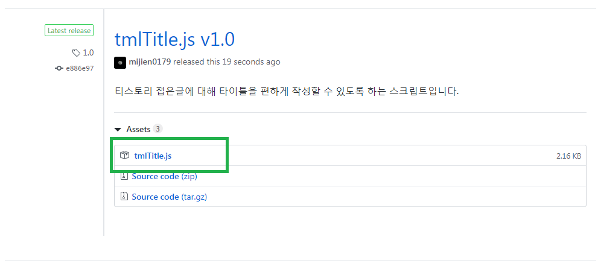
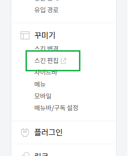
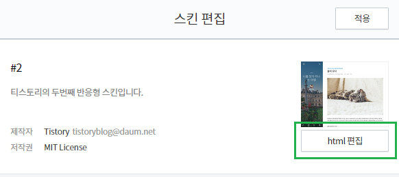
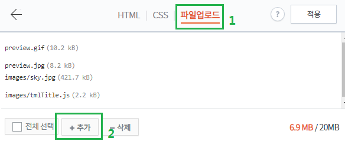
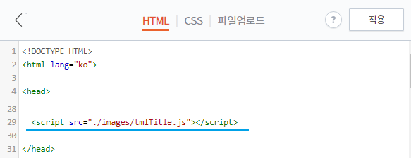
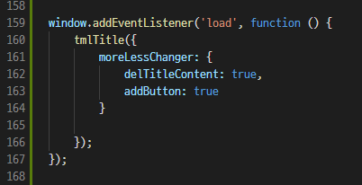
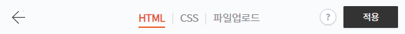
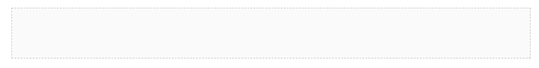
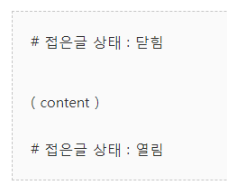
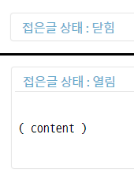

# tmlTitle.js
---
티스토리의 접은글 기능을 확장하는 스크립트입니다. 기존 버전에서 두 개의 분리된 기능을 통합한 스크립트 파일로 변경하였습니다. 새 버전의 파일을 적용할 때는 적용 스크립트를 필히 확인하기 바랍니다.

제공 기능은 다음과 같습니다.
* 접은글 상태에 따라 타이틀 지정
* 접은글 하단 열기/접기버튼 추가
* [목차 자동 생성](indexor.md)
* [주석 기능](footNote.md)

### Index
* [다운로드](#다운로드)
* [구성 속성](#구성-속성)
* [스크립트 적용 방법](#스크립트-적용-방법)
* [기능 사용 방법](#기능-사용-방법)
* [적용 결과](#적용-결과)

---
### 다운로드

https://github.com/mijien0179/tmlTitle.js/releases


---

### 구성 속성
---
스크립트의 구성 속성은 다음과 같습니다.

|속성 이름                  |데이터 타입            |기본값     |설명   					|
|--------------------------:|:----------------------|:---------:|---------------------------|
|delTitleContent            |Boolean                |false      |타이틀로 쓰는 문장 삭제	|
|prevWord                   |String                 |'# '       |접두사 지정				|
|addButton					|Boolean				|false		|하단에 여닫는 버튼 추가	|
|defaultOpenTitle			|String					|'더보기'	|기본 타이틀(상태:closed)	|
|defaultCloseTitle			|String					|'닫기'		|기본 타이틀(상태:opened)	|

---
### 스크립트 적용 방법
파일을 다운로드 받습니다. 최신 버전은 [github releases](https://github.com/mijien0179/tmlTitle.js/releases)에서 받을 수 있습니다.
<br>
*최신 버전 상황에 따라 위 이미지는 다를 수 있습니다.* 


<br>
관리자 페이지에서 스킨 편집에 들어갑니다.


<br>
오른쪽 상단의 html 편집 버튼을 클릭합니다.


<br>
상단 메뉴에서 파일 업로드를 누르고 하단의 추가 버튼으로 추가합니다.


<br>
업로드를 완료하면 상단 HTML 탭을 누른 뒤, head 태그 안에 아래 코드를 넣어줍니다.
```
    <script src="./images/tmlTitle.js"></script>
```


<br>
아래 코드를 그 다음으로 작성해줍니다.
```
	<script>
		window.addEventListener('load', function(){
			tmlTitle({
				moreLessChanger:{
					delTitleContent:true,
					addButton:true
				}
			});
		});
	</script>
```
[속성](#구성-속성)은 기호에 맞게 선택하세요.

<br>
적용 버튼을 누르면 스크립트 적용이 완료됩니다.

---
### 기능 사용 방법
<br>
타이틀을 적용하고싶은 접은글을 선택합니다.

<br>
접은글 상태가 **닫혀 있을 때 보일 타이틀**은 접은글 내부의 **최상단 첫 문장**으로,

**열려 있을 때 보일 타이틀**은 접은글 내부 **최하단 마지막 문장**으로 작성하면 됩니다.

이 때, 첫 문장을 타이틀로 적용하려면 속성의 **preWord**의 값을 접두사로 붙여주어야 합니다. 기본 값은 [속성 탭](#구성-속성)을 참고하세요.

---
### 적용 결과

